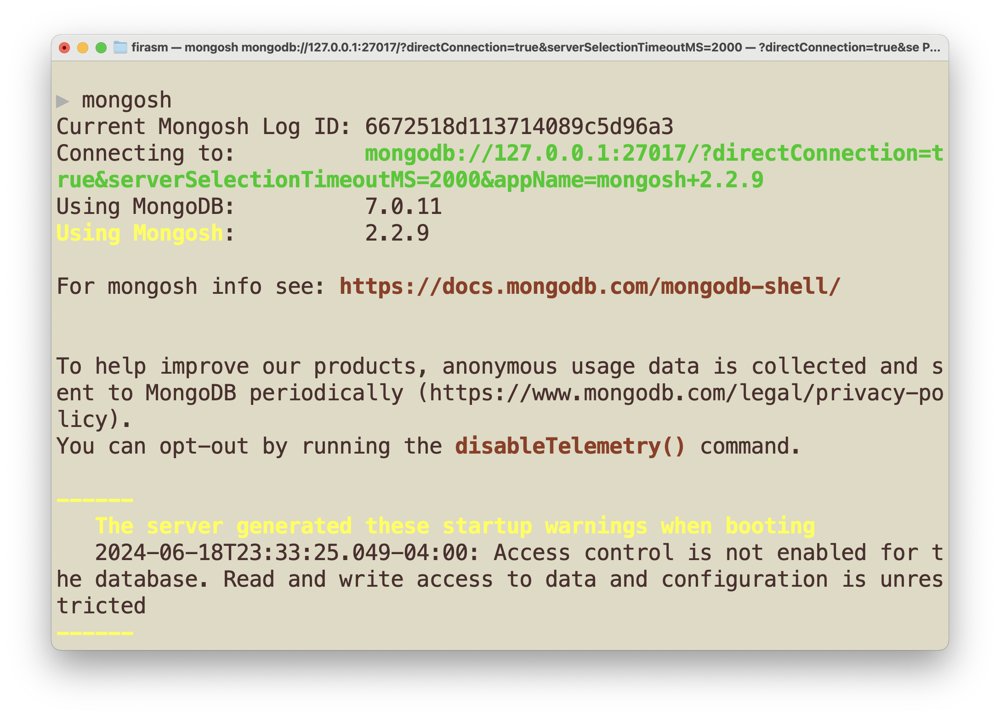

# Workshop 4: Saturday June 22, 2024

Below are the slides from today's class embedded and [linked here]().

## Pre-Workshop Tasks

### Installing MongoDB

1. Install MongoDB Community Edition

- macOS: Use [these instructions](https://www.mongodb.com/docs/manual/tutorial/install-mongodb-on-os-x/) to install using `homebrew`.
    - Once done, start the services using `brew services start mongodb/brew/mongodb-community`
- Windows: Use [these instructions](https://www.mongodb.com/docs/manual/tutorial/install-mongodb-on-windows/) to install using an MSI (recommended).

2. Install the [new Mongo Shell (Mongosh)](https://www.mongodb.com/try/download/shell)
- Windows: Extract the folder from the zip file and place it wherever you’d like
- macOS: Open a new Terminal, and run the command: `brew install mongosh`

<!-- 
1. Go to [MongoDB Download Center](https://www.mongodb.com/try/download/community)
- MongoDB Community Server
- Version: “7.0.11 (current release)”
- Platform: Windows, For package, choose `msi`
- Platform: MacOS, For package, choose `tgz`

2. Click "Download" and then install MongoDB
- May take a few minutes to download
- macOS: Use [these instructions](https://www.mongodb.com/docs/manual/tutorial/install-mongodb-on-os-x/) to install using homebrew.
- Windows: Use [these instructions](https://www.mongodb.com/docs/manual/tutorial/install-mongodb-on-windows/)
    - Choose Setup Type: Complete
    - Service Configuration: Leave selected defaults 
    - Install MongoDB Compass: Install MongoDB Compass (optional - not necessary)
    - After successful installation, MongoDB Compass should be launched (if installed). Close the Compass window.
3. Download the [new Mongo Shell (Mongosh)](https://www.mongodb.com/try/download/shell)
- Version: 2.2.9
- Extract the folder from the zip file and place wherever you’d like
-->

### Configuring mongo shell - Windows

1. Add path to MongoDB Shell executable bin folder (something like `C:\mongosh-1.10.1-win32-x64\bin` if you placed the folder in the C drive) as a PATH system environment variable
(For help setting the PATH variable: Google it, or read [this](https://www.architectryan.com/2018/03/17/add-to-the-path-on-windows-10/))
1. Close any open command prompt windows (environment variables will not be reloaded while there are open command prompt windows)
1. Start command prompt window and type `mongosh`. If you see:
    1. Connecting to: <mongodb address>
    1. Using MongoDB: 7.0.11
    1. Using Mongosh: 2.2.9 (the picture is old … so just imagine new versions where the old ones are 😀)

        

### Configuring mongo shell - macOS

Configuring `mongosh` on macOS is not necessary as long as you used `homebrew` to do the installation as specified above.

In a Terminal window, run the command: `brew install mongosh`, you should see an image like this if things are working correctly:

<!-- 1. Add path to MongoDB Shell executable bin folder as a “Path” system environment variable. Best way is probably to use .bash_profile file in the home directory. You can create the file if it’s not already there.
1. Close any open terminal windows (bash profile will not be reloaded while there are open terminal windows)
1. Start terminal window and type `mongosh`. You should hopefully see something similar to the image above under the Windows instructions (if someone would like to share a screenshot of what they see in a Mac, I can update this 😀) -->

### Create an Atlas Sandbox Cluster

Create an Atlas Sandbox Cluster

1. Register for an account with Atlas (https://www.mongodb.com/try)
- Create an account
- Fill out the quick survey
- When it takes you to a page to create a cluster:
    - Cloud Provider & Region: AWS and N. Virginia (us-east-1)
    - Cluster Tier: Shared and M0 Sandbox
    - Additional Settings: No to everything
    - Cluster Name: Sandbox
1. Click “Create Cluster” and then wait for cluster to be set up - will take a couple of minutes
1. On left side menu under Security click “Database Access”
- “Add New Database User”
    - Authentication Method: Password
    - Password Authentication
        - `m001-student`
        - `m001-mongodb-basics`
    - Database User Privileges: Built-in user -> Atlas admin
- “Add user”
1. On left side menu unset Security click “Network Access”
- “Add IP Address”
    - “Allow Access from Anywhere”
- “Confirm”
1. Go Deployments on left side, and select Database from left side menu
- Select “Connect” for your Sandbox cluster
- Select “Shell”
- Don’t do Steps 1) and 2) in prompt. Just copy connection command under Step 3). 
1. Paste copied connection command into command prompt/terminal. Also paste the connection command in a place/document readily available. You will be using this command in the workshop
    - When prompted for password enter `m001-mongodb-basics`   
1. If successfully connected, after some connection log lines should see:
`Atlas atlas-hxpgby-shard-0 [primary] test>`

## Technical Content slides

<iframe src="" frameborder="0" width="100%" height="600px" allowfullscreen="true" mozallowfullscreen="true" webkitallowfullscreen="true"></iframe>

