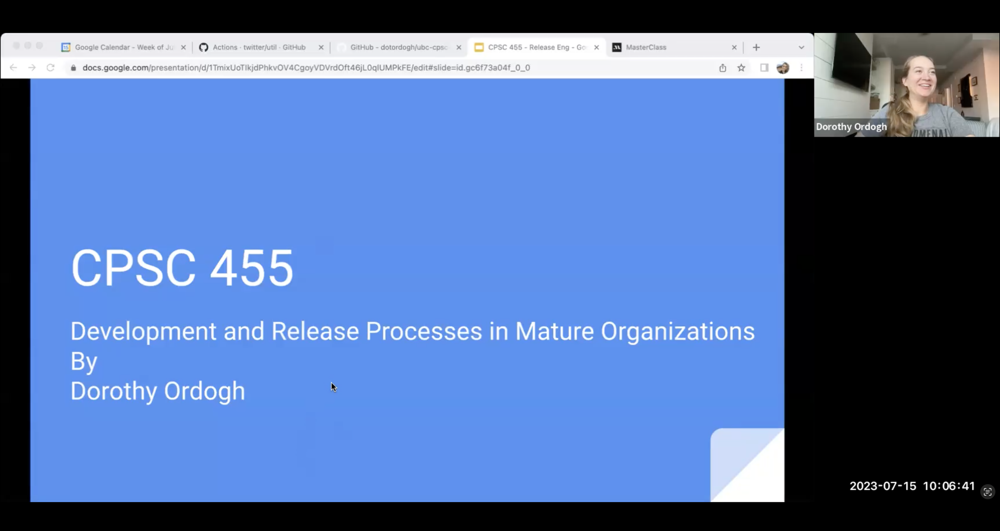

# Workshop 5: Saturday July 13, 2024

We are going to do something slightly different for Workshop 5 - the Saturday session will be structured slightly differently, but we'll be starting at 10 AM as usual and **you will need to watch an asynchronous recording** as preparation.
There will be two aspects to this workshop:

1. Theoretical Portion (Asynchronous Video)
2. Practical Portion (Live on Saturday)

The theoretical portion will be presented by an industry expert (Dorothy Ordogh) and a practically crash course on GitHub Actions for deployment from one of your course instructors.

## Theoretical Portion (Asynchronous Video)

Here is a recorded video (click the image) from Dorothy from last year:

```{tip}
The password for the video recording will be shared with you on Slack.
```

<a href="https://ubc.zoom.us/rec/share/a0RGCncyD58TxcnNc0Z3i1ZjodrdfSOZkTgaM91_vh5IIK0HFpP47wo6zL-k7F-p.-6P0h86FrfQwh3WJ"></a>

Here are the slides from Dorothy Ordogh:

<div>
<iframe src="../../workshop5.pdf" width="100%" height="600px" frameBorder="0"> </iframe>
</div>

## Practical Portion (Live on Saturday)

<div>
<iframe src="../../github_actions.pdf" width="100%" height="600px" frameBorder="0"> </iframe>
</div>

### Pre-Workshop Tasks

N/A

### Tasks during Workshop

- Accept [Workshop 6 repository](https://classroom.github.com/a/c_ZEKiyH)
- Create a [Render.com](https://render.com) account