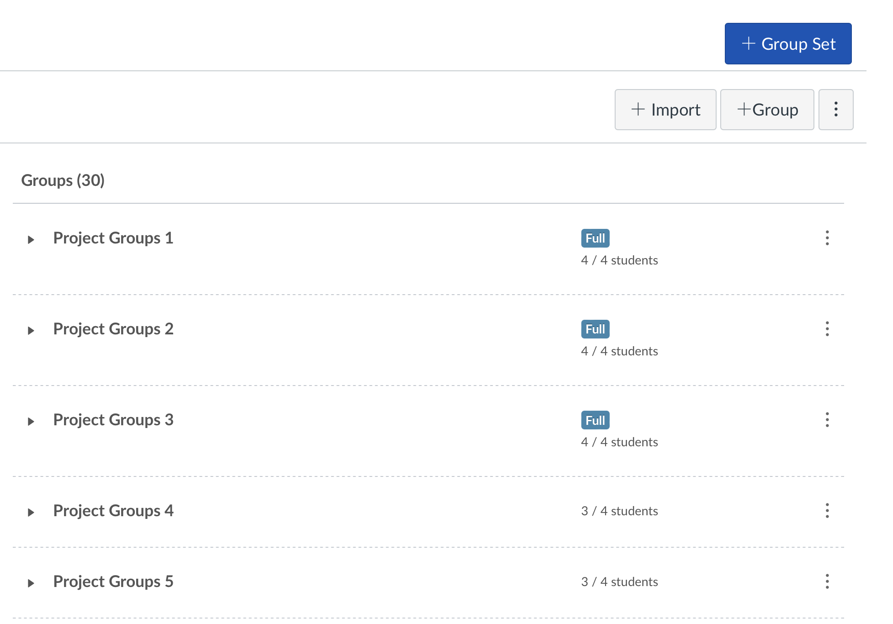
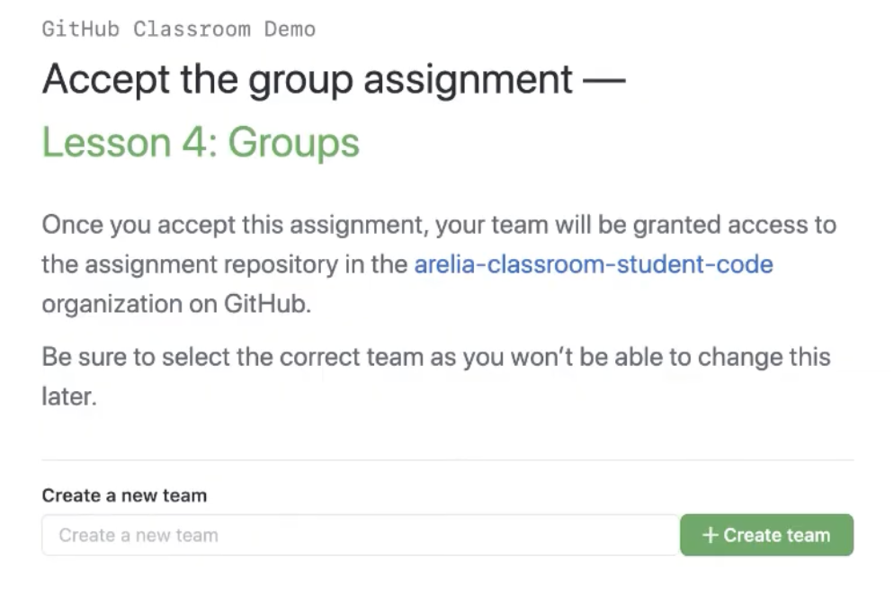
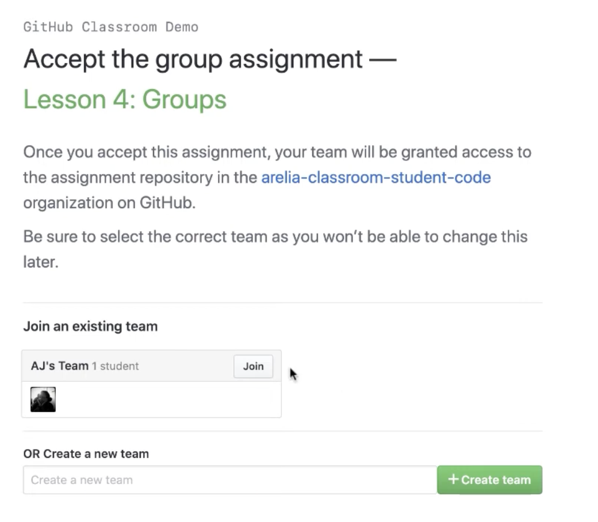

# Progress 1

## First steps

Brainstorm some ideas for the first lab.
In Lab 1A, we will finalize groups, and discuss project ideas.
By Lab 1B, you should have selected a project topic. 

## Project Requirements:

Must be completed with your group by Workshop 2. (Will be graded in Design Review.)

- Must have a repo in github which all group members can access and send us the link(we’ll provide a form)
- In order to create a repo, you will need to decide on a project name
- Project Description: Write 3-5 sentences on your project topic. (try to address all points below)
    - Who is it for?
    - What will it do? (What "human activity" will it support?)
    - What type of data will it store?
    - What will users be able to do with this data?
    - What is some additional functionality you can add/remove based on time constraints?
- Project task requirements:
    - 3-5 minimal requirements (will definitely complete)
    - 3-7 "standard" requirements (will most likely complete)
    - 2-3 stretch requirements (plan to complete at least 1!)
- Pick 2 of your minimal requirements and break each of them down into ~2-5 smaller tasks!
    - This will help you divide up work among your teammates
- Finally, draw 2-3 rough sketch prototypes of some key tasks of your app. Sketch these physically on paper and then scan and add to your repo. (If you’d like to use sketch/prototype software because that’s easier somehow, you can, but we’d advise against it as these prototypes should be low-fidelity (i.e. look bad)).

## Before you form your group

See the [details here](team_formation) before proceeding!

## Form your Group

1. When you're ready to form your group, you should all first self-select a Group on Canvas, let's say you are Group03:



2. Then, you should come up with (an appropriate) team name (short, snappy, witty). Let's say the team name is `auroras_borealjs`.

3. Designate one person in the team that will be responsible for "create a team" on GitHub (you will get the link to do this in the next step) using the following format: `XY_team_name`, for us it will be: `03_auroras_borealjs`.

```{tip}
Please help us by making sure the repo names are set according to this format: `XY_team_name` so it is easier for our TAs to grade. 

An example will be: `03_auroras_borealjs`.
```

4. The designated person in the previous step should [use the following GitHub Classroom link](https://classroom.github.com/a/MohHZSau) to create a team.



5. Once the first person has created the team, a repo will automatically be created, and the three other group members should join:



6. That's it! Once everyone joins, all team members should have admin access to that repo - this is now your repo for the rest of the term!

## How to submit

Put all of the writing (Project Description, Project Task requirements, task breakdown), as well as your prototypes into the README of your project repo.
You will be submitting your project repository on Canvas - note: your project repository **must** be under the course and term organization (i.e. it cannot be a personal repository).
ALSO, for each team member, go on slack and edit your profile. In the "What I do" space, put your team name and team number!
